# Getting started with project 1

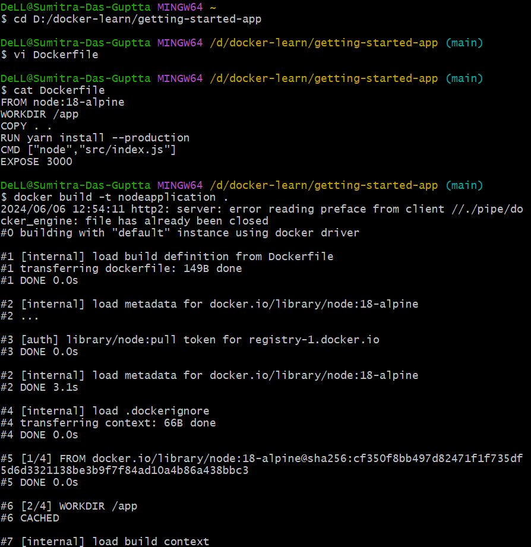
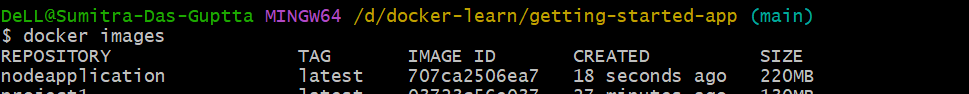
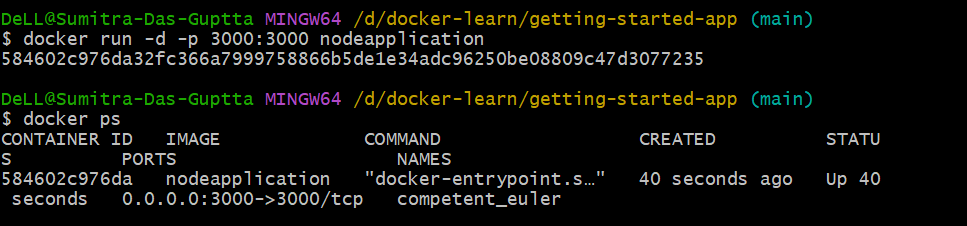
## Output on browser
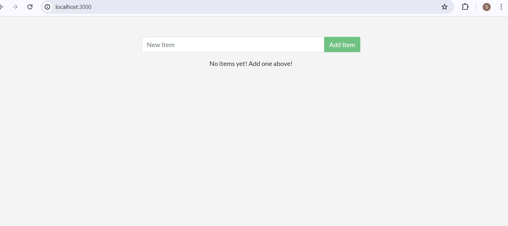

# Project 2 DIY
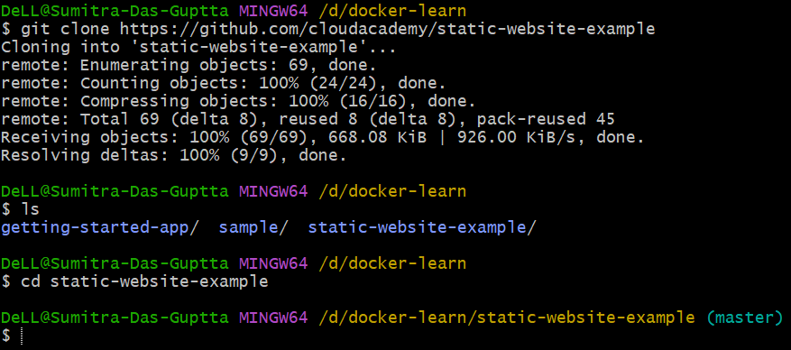 
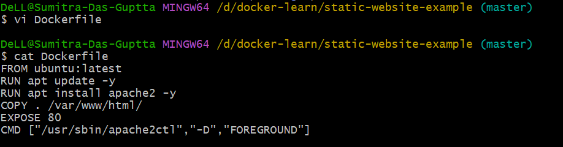
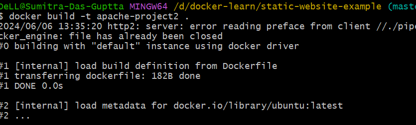
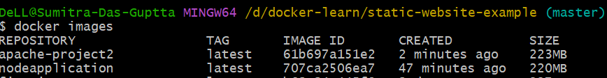

## Ouput on browser

# Project 3 Python
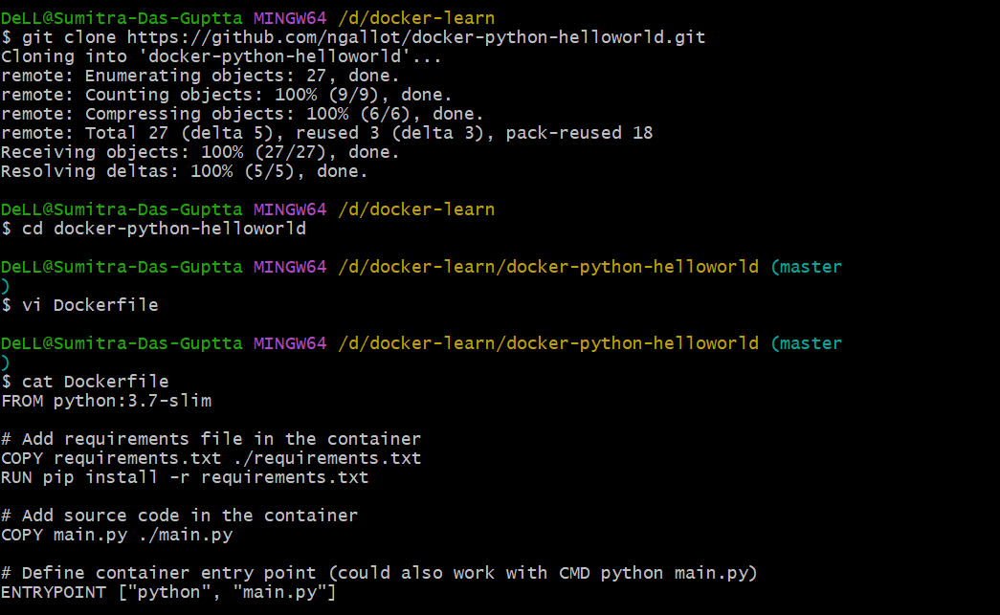
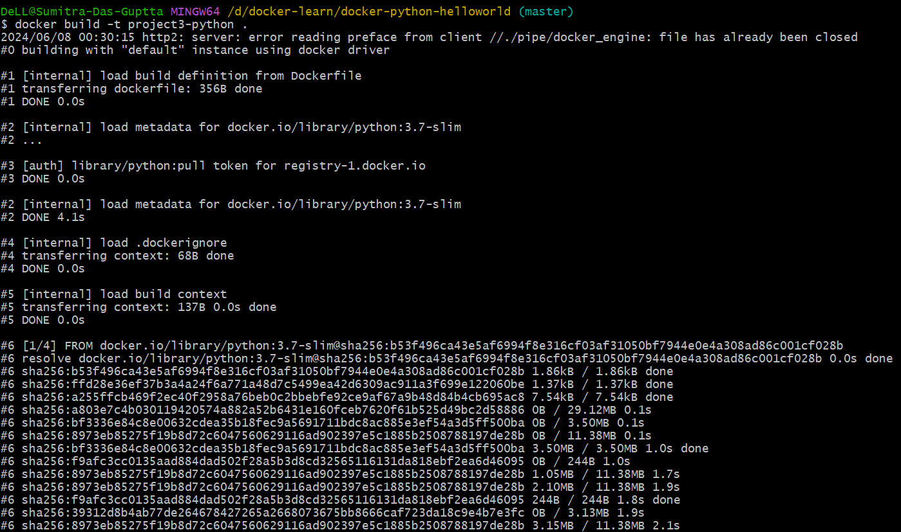
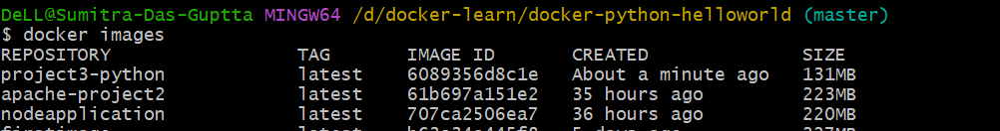
## Output
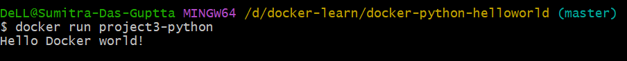

# Project 3 Bonus
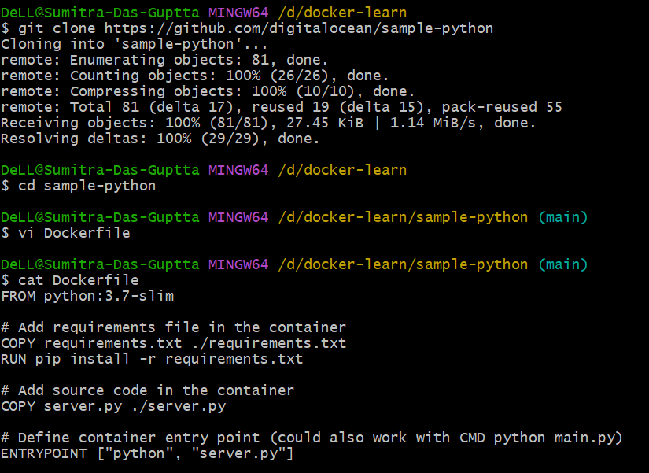
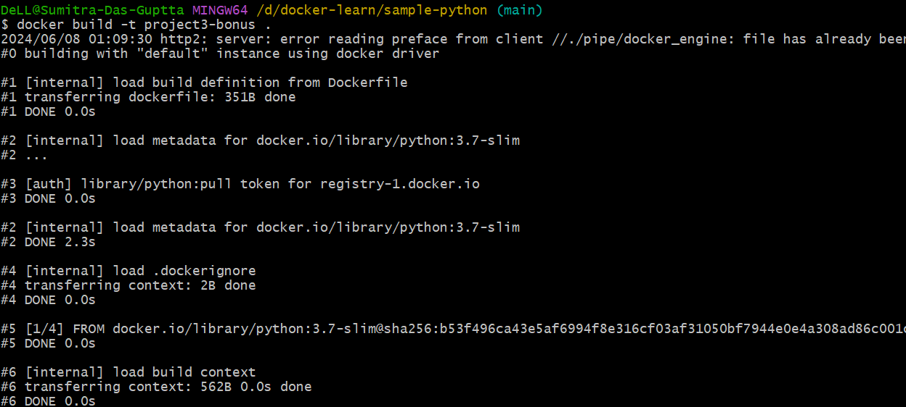
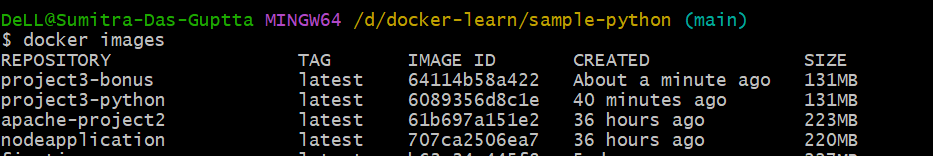
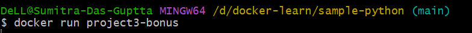
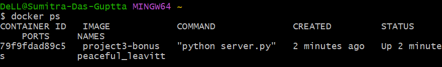

# Project 4
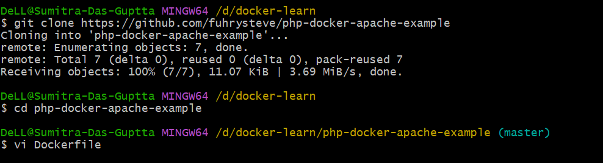
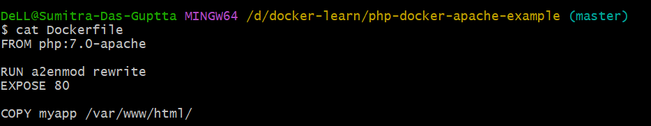
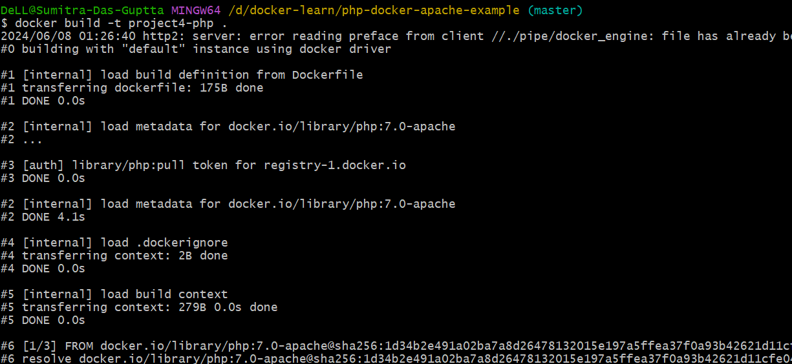
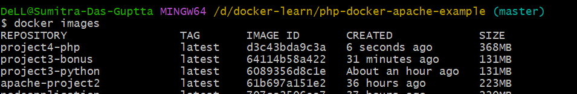
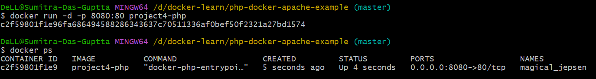
## Output
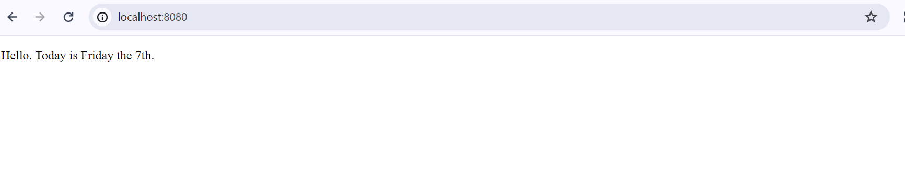

# Project 4 Bonus

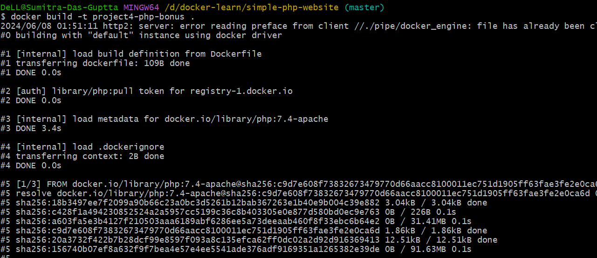
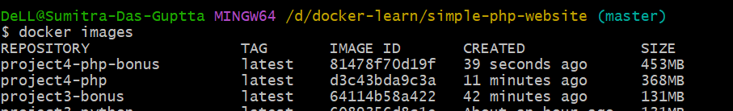
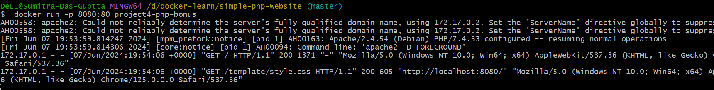
## Output
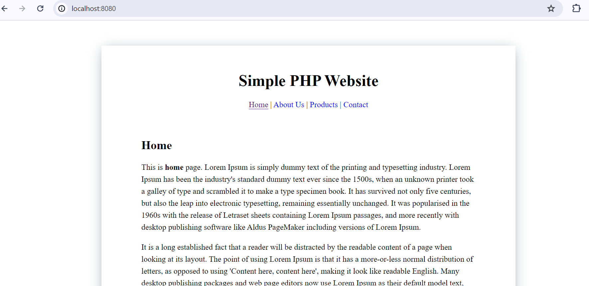
