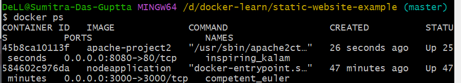
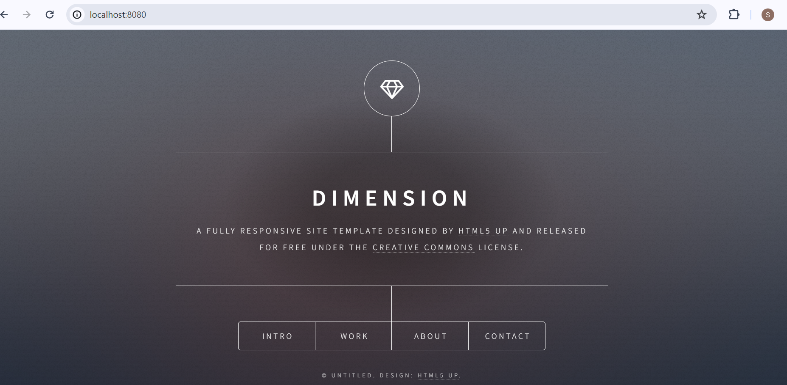
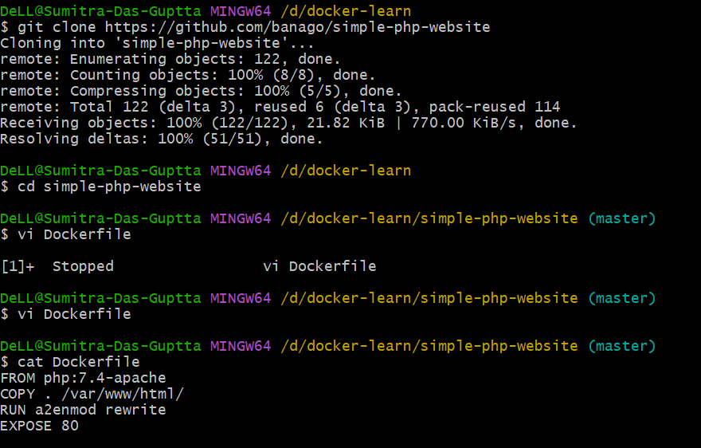

# Getting started with project 1

## Output on browser

# Project 2 DIY
 

## Ouput on browser

# Project 3 Python

## Output

# Project 3 Bonus

# Project 4

## Output

# Project 4 Bonus

## Output

